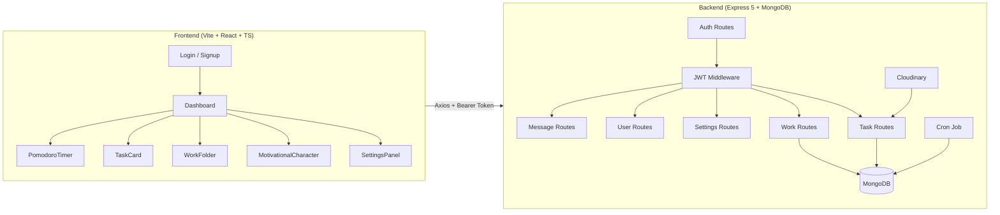
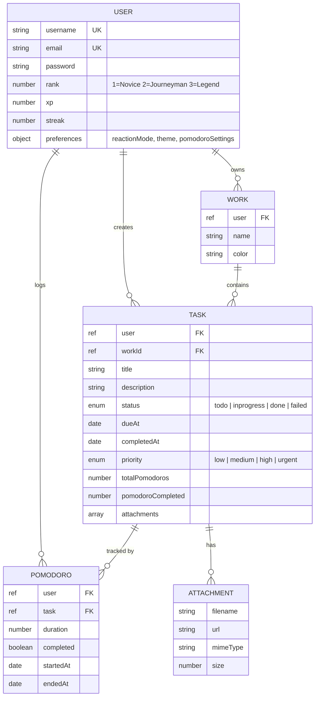
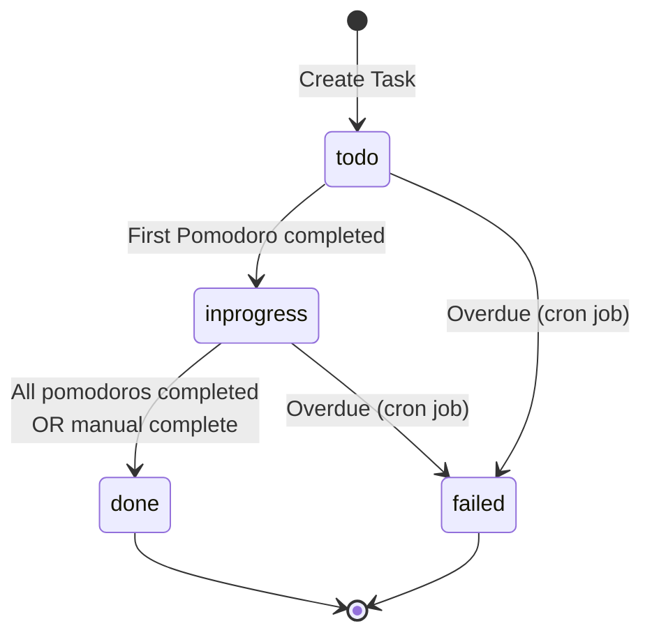
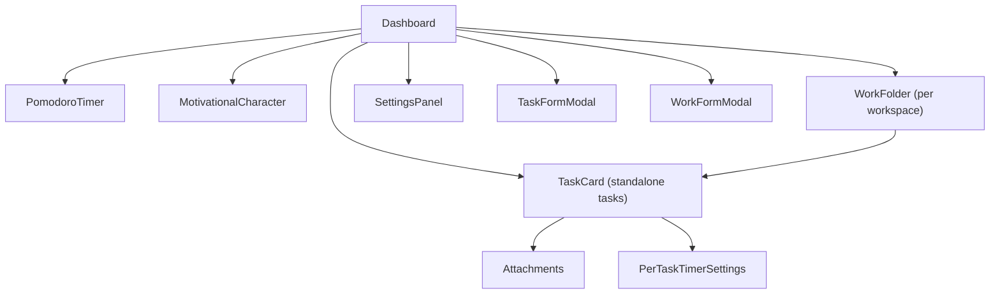
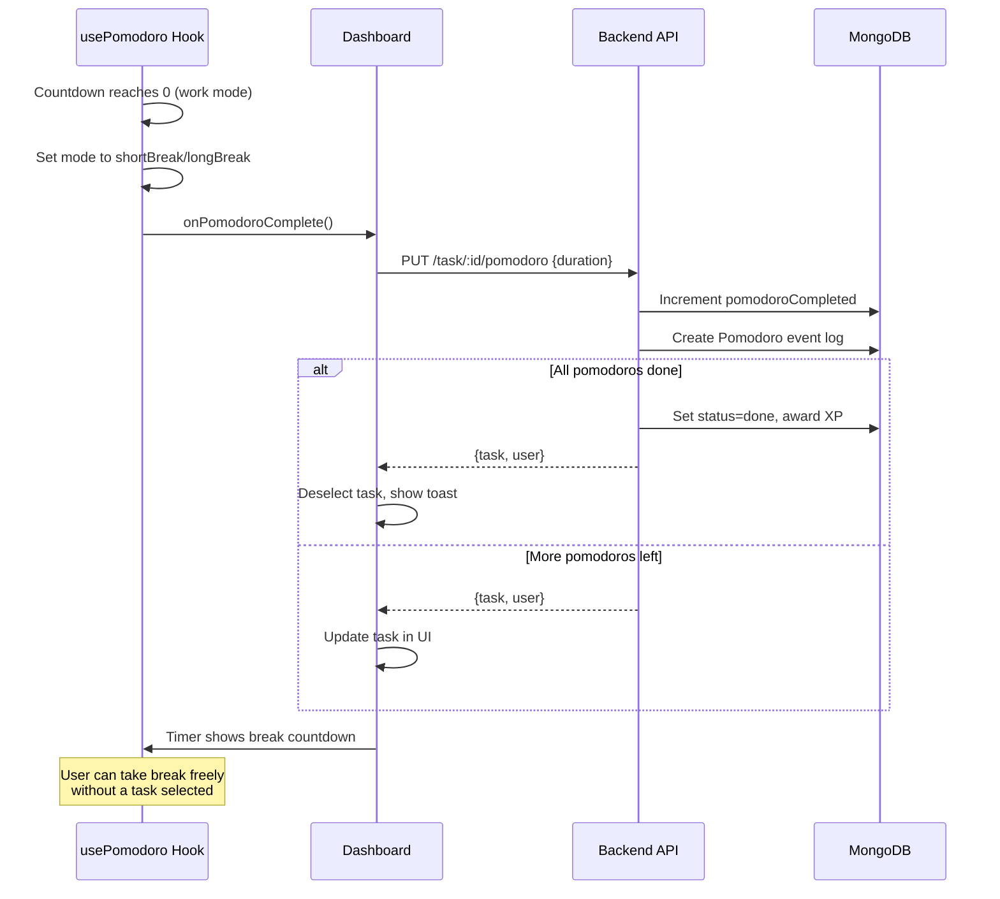

# OverDo — Project Report

> A gamified productivity app combining **task management**, a **Pomodoro timer**, and a **motivational character system** with rank progression.

---

## Architecture Overview



---

## Tech Stack

| Layer | Technology |
|-------|-----------|
| **Frontend** | React 18, TypeScript, Vite, Tailwind CSS, shadcn/ui |
| **Animations** | Framer Motion, Spline 3D (Legend rank background) |
| **Backend** | Express 5, Node.js (ESM), Mongoose 9 |
| **Database** | MongoDB (via Mongoose) |
| **Auth** | JWT (Bearer token), bcryptjs |
| **File Storage** | Cloudinary (via multer-storage-cloudinary, 5MB limit) |
| **Scheduling** | node-cron (task failure detection every 2 hours) |

---

## Data Models



---

## Backend Flow

### Authentication
1. **Register** (`POST /api/auth/register`) — hashes password with bcrypt, creates user, auto-creates a **"Standalone" workspace**, returns JWT (1h expiry)
2. **Login** (`POST /api/auth/login`) — verifies email + password, returns JWT
3. **Auth Middleware** — extracts `Bearer` token from `Authorization` header, verifies with `jsonwebtoken`, injects `req.userId`

### Task Lifecycle



- **Create** → status `todo`, assigned to a Work folder (defaults to "Standalone")
- **Pomodoro complete** → increments `pomodoroCompleted`, moves to `inprogress` on first one
- **All pomodoros done** → auto-marks `done`, awards XP (10 if on-time, 5 if late), adjusts streak
- **Manual complete** → same XP/streak logic as above
- **Cron job** (every 2h) → finds `todo` tasks past `dueAt`, marks `failed`, deduces 5 XP, resets streak

### Gamification (XP / Rank / Streak)

| Event | On Time | Late |
|-------|---------|------|
| Task completed | +10 XP, streak +1 | +5 XP, streak reset to 0 |
| Task failed (cron) | — | -5 XP, streak reset, possible rank down |
| Rank up | At 100 XP → rank +1, XP resets to 0 | — |

**Ranks**: Novice (1) → Journeyman (2) → Legend (3)

### API Routes Summary

| Method | Route | Description |
|--------|-------|-------------|
| `POST` | `/api/auth/register` | Register new user |
| `POST` | `/api/auth/login` | Login |
| `GET` | `/api/user/me` | Get current user |
| `DELETE` | `/api/user/me` | Delete user + all data |
| `GET` | `/api/task` | Get all tasks + pomodoros |
| `POST` | `/api/task` | Create task |
| `PUT` | `/api/task/:id` | Update task |
| `DELETE` | `/api/task/:id` | Delete task |
| `POST` | `/api/task/:id/complete` | Mark task complete |
| `PUT` | `/api/task/:id/pomodoro` | Complete a pomodoro |
| `POST` | `/api/task/:id/attachment` | Upload attachment |
| `DELETE` | `/api/task/:id/attachment/:index` | Delete attachment |
| `GET` | `/api/work` | Get all workspaces |
| `POST` | `/api/work` | Create workspace |
| `DELETE` | `/api/work/:id` | Delete workspace + tasks |
| `GET` | `/api/settings` | Get user preferences |
| `PUT` | `/api/settings` | Update preferences |
| `GET` | `/api/messages` | Get motivational messages |

---

## Frontend Flow

### Routing & Auth

```mermaid
graph TD
    A[App Entry] --> B{Has Token?}
    B -->|No| C[/login]
    B -->|Yes| D{Verify via /user/me}
    D -->|Valid| E[/ Dashboard]
    D -->|Invalid| C
    C --> F[/signup]
    F --> C
```

- JWT stored in `localStorage`, injected into every request via Axios interceptor
- [AuthContext](file:///d:/Learning%20Programming/MERN%20Project/OverDo/Frontend/OverDo_Frontend/src/auth/AuthContext.tsx#4-10) provides `isAuthenticated`, [loginUser](file:///d:/Learning%20Programming/MERN%20Project/OverDo/Frontend/OverDo_Frontend/src/auth/AuthContext.tsx#40-44), [logoutUser](file:///d:/Learning%20Programming/MERN%20Project/OverDo/Frontend/OverDo_Frontend/src/auth/AuthContext.tsx#45-49)
- [ProtectedRoute](file:///d:/Learning%20Programming/MERN%20Project/OverDo/Frontend/OverDo_Frontend/src/auth/ProtectedRoutes.tsx#5-21) wraps Dashboard — redirects to `/login` if unauthenticated

### Dashboard Architecture

The Dashboard ([Dashboard.tsx](file:///d:/Learning%20Programming/MERN%20Project/OverDo/Frontend/OverDo_Frontend/src/pages/Dashboard.tsx)) is the **single-page hub** that orchestrates everything:



**Data loading**: On mount, fetches user, tasks, works, and messages in parallel via `Promise.all`.

### Pomodoro Timer System

The timer is **general-purpose** — it cycles through work/break sessions independently of any task:

```
Work → Short Break → Work → Short Break → ... → Work → Long Break → Reset
         (cycle 1)          (cycle 2)              (cycle N)
```

- `cyclesBeforeLongBreak` controls how many work sessions before a long break (default: 4)
- [usePomodoro](file:///d:/Learning%20Programming/MERN%20Project/OverDo/Frontend/OverDo_Frontend/src/hooks/use-pomodoro.ts#8-135) hook manages: `timeRemaining`, `totalTime`, `isRunning`, `mode`, `currentCycle`
- When a work session completes naturally, [onPomodoroComplete](file:///d:/Learning%20Programming/MERN%20Project/OverDo/Frontend/OverDo_Frontend/src/pages/Dashboard.tsx#93-99) fires → calls [incrementPomodoro](file:///d:/Learning%20Programming/MERN%20Project/OverDo/Frontend/OverDo_Frontend/src/lib/api.ts#61-65) API
- Task can be associated/dissociated from the timer at any time without affecting the cycle
- Breaks can run freely without a task selected

### Motivational Character System

An animated mascot that reacts to user behavior — selects messages based on:

| Context | Sentiment | Category Used |
|---------|-----------|---------------|
| No tasks | Positive | `welcome` |
| On break | Negative | `break` |
| Overdue tasks | Negative | `overdue` |
| ≥70% completion OR ≥5 streak | Positive | `good` |
| ≥30% completion | Positive | `average` |
| Everything else | Negative | `poor` |

**3 reaction modes**: Friendly 😊, Sarcastic 😏, Aggressive 😤 — each with different tones. Messages rotate every 25 seconds. Avatar image changes based on mode + sentiment (5 unique images).

### Rank-Based Visual Theming

| Rank | Background | Visual Style |
|------|-----------|-------------|
| **Novice** (1) | Subtle particle animation | Floating dots with radial gradients |
| **Journeyman** (2) | Animated orbs | Blurred circles moving with Framer Motion |
| **Legend** (3) | 3D scene | Spline 3D overlay + animated orbs |

Each rank also applies a CSS class (`rank-novice`, `rank-journeyman`, `rank-legend`) that sets a different accent color palette for the entire UI.

### UI Component Library

Uses **shadcn/ui** (Radix-based) with custom glassmorphism styling:
- `glass` / `glass-subtle` / `glass-modal` — frosted-glass look
- `glow` — applied to active elements
- Custom CSS variables for priority colors, status colors, rank accents
- Fully responsive layout with grid breakpoints

### Key Frontend Files

| File | Purpose |
|------|---------|
| [Dashboard.tsx](file:///d:/Learning%20Programming/MERN%20Project/OverDo/Frontend/OverDo_Frontend/src/pages/Dashboard.tsx) | Main page — state management, data loading, all handlers |
| [use-pomodoro.ts](file:///d:/Learning%20Programming/MERN%20Project/OverDo/Frontend/OverDo_Frontend/src/hooks/use-pomodoro.ts) | Pomodoro timer hook (cycle management, countdown) |
| [PomodoroTimer.tsx](file:///d:/Learning%20Programming/MERN%20Project/OverDo/Frontend/OverDo_Frontend/src/components/dashboard/PomodoroTimer.tsx) | Circular timer UI with SVG progress ring |
| [TaskCard.tsx](file:///d:/Learning%20Programming/MERN%20Project/OverDo/Frontend/OverDo_Frontend/src/components/dashboard/TaskCard.tsx) | Expandable task card (priority, progress, attachments, per-task settings) |
| [MotivationalCharacter.tsx](file:///d:/Learning%20Programming/MERN%20Project/OverDo/Frontend/OverDo_Frontend/src/components/dashboard/MotivationalCharacter.tsx) | Animated mascot with speech bubbles |
| [RankBackground.tsx](file:///d:/Learning%20Programming/MERN%20Project/OverDo/Frontend/OverDo_Frontend/src/components/dashboard/RankBackground.tsx) | Rank-based animated backgrounds (particles, orbs, Spline 3D) |
| [SettingsPanel.tsx](file:///d:/Learning%20Programming/MERN%20Project/OverDo/Frontend/OverDo_Frontend/src/components/dashboard/SettingsPanel.tsx) | Settings sheet (motivation style, timer defaults, rank preview, logout) |
| [character-messages.ts](file:///d:/Learning%20Programming/MERN%20Project/OverDo/Frontend/OverDo_Frontend/src/lib/character-messages.ts) | Message selection logic (context-aware, fetched from backend) |
| [api.ts](file:///d:/Learning%20Programming/MERN%20Project/OverDo/Frontend/OverDo_Frontend/src/lib/api.ts) | Typed API wrapper for all backend endpoints |

---

## Complete Request Flow Example

**User completes a Pomodoro work session:**



---

## File Tree

```
OverDo/
├── Backend/
│   ├── package.json            (Express 5, Mongoose 9, bcrypt, JWT, Cloudinary, node-cron)
│   └── src/
│       ├── server.js           (Entry: CORS, routes, MongoDB connection)
│       ├── config/
│       │   └── cloudinary.js
│       ├── controller/
│       │   ├── authController.js       (login, register + auto Standalone workspace)
│       │   ├── taskController.js       (CRUD, completeTask, completePomodoro, attachments)
│       │   ├── userController.js       (getCurrentUser, deleteUser)
│       │   ├── workController.js       (CRUD with cascade delete)
│       │   ├── settingsController.js   (get/update preferences)
│       │   ├── analyticsController.js  (getFocusTime)
│       │   └── messageController.js    (hardcoded motivational messages)
│       ├── cron/
│       │   └── taskFailure.cron.js     (Mark overdue todos as failed, every 2h)
│       ├── middleware/
│       │   ├── authMiddleware.js       (JWT verification)
│       │   └── multer.js              (Cloudinary upload config)
│       ├── models/
│       │   ├── userModel.js           (username, email, rank, xp, streak, preferences)
│       │   ├── taskModel.js           (status, priority, pomodoros, attachments)
│       │   ├── workModel.js           (name, color)
│       │   ├── pomodoroModel.js       (event log: duration, timestamps)
│       │   └── statsModel.js          (aggregate stats — optional/future)
│       └── routes/
│           ├── authRoutes.js
│           ├── taskRoutes.js
│           ├── workRoutes.js
│           ├── settingsRoutes.js
│           ├── userRoutes.js
│           ├── messageRoutes.js
│           └── analyticsRoutes.js
│
└── Frontend/OverDo_Frontend/
    ├── package.json            (React 18, Vite, TypeScript, Tailwind, shadcn/ui, Framer Motion)
    └── src/
        ├── App.tsx             (Router: /, /login, /signup)
        ├── main.tsx            (Entry with AuthProvider)
        ├── api/
        │   └── axios.ts        (Base URL, Bearer token interceptor)
        ├── auth/
        │   ├── AuthContext.tsx  (Auth state, token verify, login/logout)
        │   ├── ProtectedRoutes.tsx
        │   └── authService.ts
        ├── pages/
        │   ├── Dashboard.tsx   (Main hub: all state, handlers, layout)
        │   ├── Login.tsx
        │   └── Signup.tsx
        ├── components/dashboard/
        │   ├── PomodoroTimer.tsx        (Circular SVG timer)
        │   ├── MotivationalCharacter.tsx (Animated mascot + speech)
        │   ├── RankBackground.tsx       (3-tier animated bg)
        │   ├── TaskCard.tsx             (Expandable task card)
        │   ├── WorkFolder.tsx           (Workspace accordion)
        │   ├── TaskFormModal.tsx         (Create/edit task modal)
        │   ├── WorkFormModal.tsx         (Create workspace modal)
        │   └── SettingsPanel.tsx         (Settings side sheet)
        ├── components/ui/              (40+ shadcn/ui components)
        ├── hooks/
        │   └── use-pomodoro.ts          (Timer logic hook)
        ├── lib/
        │   ├── api.ts                   (Typed API functions)
        │   ├── character-messages.ts    (Message selection engine)
        │   └── utils.ts
        ├── types/
        │   └── index.ts                (All TypeScript interfaces)
        ├── styles/
        │   └── auth.css
        └── assets/                     (5 mascot images, background img)
```
